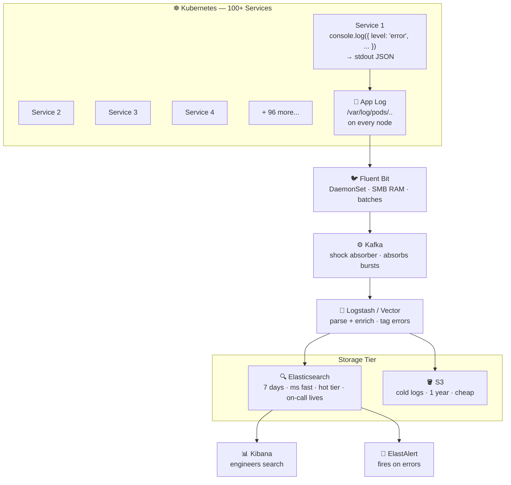

# Centralized Logging for 100+ Microservices

## Pipeline Summary

| Stage | Tool | Role |
|---|---|---|
| **Collection** | Fluent Bit (DaemonSet) | Tails `/var/log/pods` on every node, low memory |
| **Buffering** | Kafka | Shock absorber — decouples producers from consumers |
| **Processing** | Logstash / Vector | Parses, enriches, and tags log severity |
| **Hot Storage** | Elasticsearch | 7-day retention, millisecond queries for on-call engineers |
| **Cold Storage** | S3 | 1-year retention, cheap archival |
| **Visualization** | Kibana | Engineers search and explore logs |
| **Alerting** | ElastAlert | Fires alerts on error patterns |
