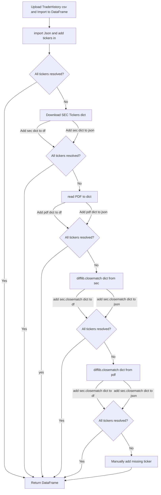

```mermaid
  flowchart TD;
      B[Upload TradeHistory csv and Import to DataFrame] --> C[import Json and add tickers in]
      C --> D{All tickers resolved?}
      D -->|Yes| E[Return DataFrame]
      D -->|No| F[Download SEC Tickers dict]
      F -- Add sec dict to df--> G{All tickers resolved?}
      F -- Add sec dict to json--> G{All tickers resolved?}
      G --Yes -->E
      G --No --> H[read PDF to dict]
      H -- Add pdf dict to df--> I{All tickers resolved?}
      H -- Add pdf dict to json--> I{All tickers resolved?}
      I -->|yes| E
      I -->|No| J[difflib.closematch dict from sec]
      J -- add sec.closematch dict to df --> K{All tickers resolved?}
      J -- add sec.closematch dict to json --> K{All tickers resolved?}
      K --Yes --> E
      K --No --> L[difflib.closematch dict from pdf]
      L -- add sec.closematch dict to df --> N{All tickers resolved?}
      L -- add sec.closematch dict to json --> N{All tickers resolved?}
      N --Yes --> E
      N --No --> M[Manually add missing ticker]
      M --> E

```
